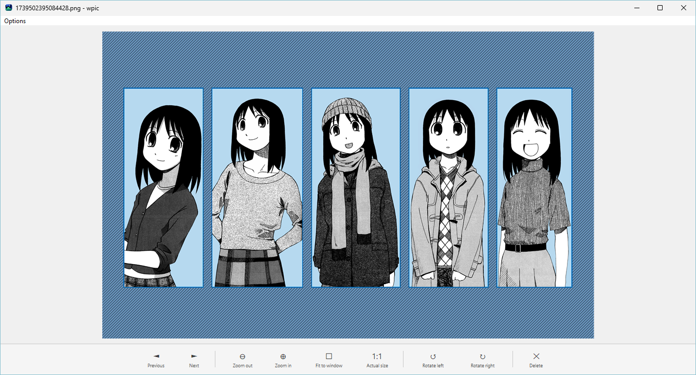

# wpic — Lightweight Windows Image Viewer

> A tiny, instant image viewer for Windows. No bloat, no telemetry, no dependencies. Just open and view.



---

## Why wpic?

Most image viewers on Windows are slow, heavy, or phone-home to the cloud. wpic is ~50KB, loads instantly, and does one thing well.

| | Microsoft Photos | wpic |
|---|---|---|
| Startup | Slow (UWP) | **Instant** |
| RAM | ~150MB | **~8MB** |
| Size | ~50MB | **~50KB** |
| Telemetry | Yes | **No** |
| Internet | Yes (OneDrive) | **No** |

---

## Features

- 🖼 **Folder navigation** — browse all images in a folder with arrow keys or buttons
- 🔍 **Zoom & pan** — scroll wheel to zoom toward cursor, drag to pan
- 🔄 **Rotation** — rotate images left/right
- 🗑 **Safe delete** — sends to Recycle Bin with confirmation
- 🌙 **Dark mode** — toggle via Options menu or `Ctrl+D`
- 📁 **Drag & drop** — drop any image to open it
- **Formats**: JPG, PNG, GIF, BMP, TIFF, WebP

---

## Keyboard Shortcuts

| Key | Action |
|-----|--------|
| `←` `→` or `Space` / `Backspace` | Previous / Next image |
| `↑` `↓` | Zoom in / out |
| `F` | Toggle fit-to-window |
| `R` | Reset rotation |
| `Delete` | Move to Recycle Bin |
| `Esc` | Exit |

---

## Building from Source

**Requirements:** MinGW-w64

```bash
# 1. Compile resources
windres wpic.rc -o wpic_res.o

# 2. Build
g++ -O2 -s wpic.cpp wpic_res.o -o wpic.exe -mwindows -static \
    -lgdiplus -luser32 -lgdi32 -lshell32 -lcomctl32 -lshlwapi -lole32 -fexceptions
```

The result is a single portable `.exe` — no installer needed.

---

## Usage

```bash
wpic.exe path\to\image.jpg
```

Or drag and drop an image onto the window. wpic auto-scans the image's folder so you can navigate all images in that directory.

---

## License

[MIT](LICENSE) — free to use, modify, and distribute.